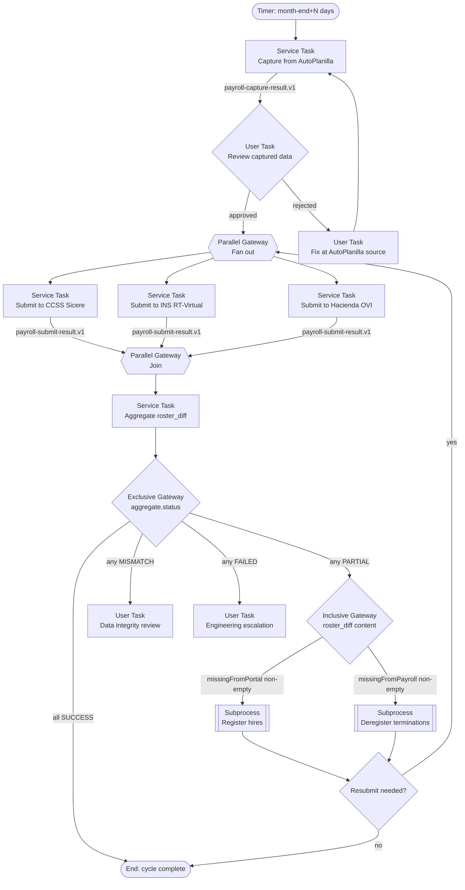
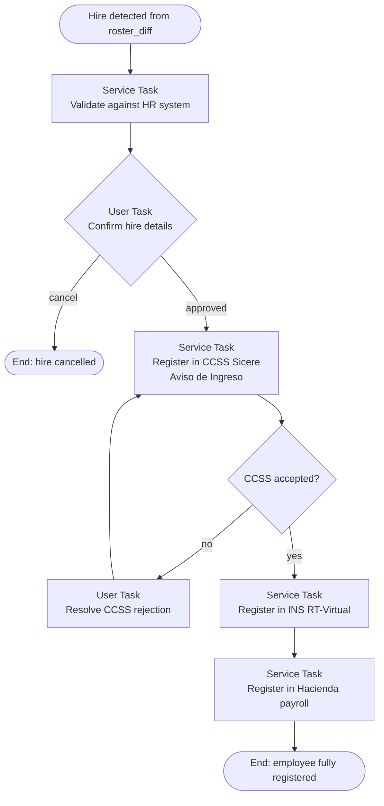
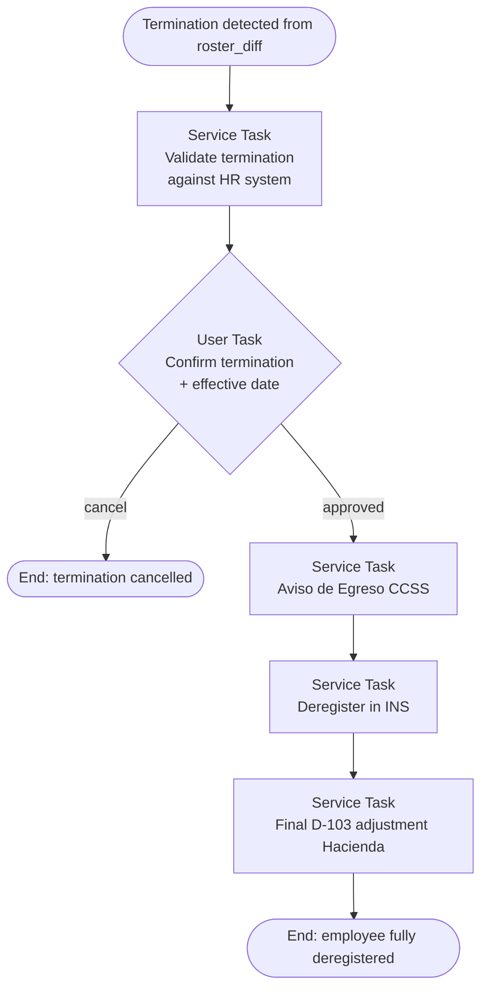

# Payroll Orchestration Flow

BPMN integration design for the monthly Costa Rica payroll cycle across four portals: AutoPlanilla (source) and three target government systems — CCSS Sicere, INS RT-Virtual, and Hacienda OVI/ATV.

**Audience:** Praxis BPM modeling team. This document translates the agent-worker contracts (`payroll-capture-result.v1`, `payroll-submit-request.v1`, `payroll-submit-result.v1`) into a concrete BPMN process model. It is intentionally tool-agnostic — diagrams use Mermaid because BPMN XML is the modeling team's deliverable, not ours.

**Out of scope:** the BPMN XML itself, the Flowable JavaDelegate Java code, or the per-portal selectors. Those are downstream of the flow shown here.

---

## 1. Systems involved

| Role | System | What it does | Agent worker view |
|---|---|---|---|
| **Source** | **AutoPlanilla** | NeoProc-managed payroll computation. Authoritative roster + computed gross/renta per employee for the period. | `autoplanilla.yaml` descriptor; emits `payroll-capture-result.v1` envelope. |
| **Target** | **CCSS Sicere** *(Sistema Centralizado de Recaudación)* | Costa Rica social security planilla submission. Required for every employer. Drives social-security contributions, healthcare, pensions. | TBD descriptor `ccss-sicere.yaml`; consumes `payroll-submit-request.v1`, emits `payroll-submit-result.v1`. |
| **Target** | **INS RT-Virtual** *(Riesgos del Trabajo)* | Workplace-accident insurance. Monthly contribution computed from same payroll basis as CCSS. | TBD `ins-rt-virtual.yaml` descriptor + adapter. |
| **Target** | **Hacienda OVI / ATV** *(Administración Tributaria Virtual)* | Income-tax withholding declaration (Renta — typically D-103 monthly). | TBD `hacienda-ovi.yaml` descriptor + adapter. |

The three target systems share a payroll basis but **do not share a portal, data model, or login**. Each is its own Service Task in BPM and its own descriptor + adapter pair on the agent side.

---

## 2. Top-level monthly cycle

### Walkthrough

1. **Trigger.** Timer fires N days after month-end (configurable per firm — CCSS deadline drives the cap). Could also be a manual user-initiated start for off-cycle runs.
2. **Capture.** Single Service Task fires the AutoPlanilla agent. Worker returns `payroll-capture-result.v1` envelope with totals + per-employee rows.
3. **Review captured data.** User Task — payroll administrator inspects what the agent captured before any submission. This is the **first four-eyes gate** per [TechnicalRequirements §6](TechnicalRequirements.md#L66-L80). On rejection, the upstream AutoPlanilla data is fixed by a human and capture re-runs.
4. **Parallel fan-out.** Three Service Tasks fire concurrently — one per target system. Each receives the **same** capture envelope as its `payroll-submit-request.v1` payload (envelopeId differs per task; capture's envelopeId is referenced in the audit block for traceability).
5. **Parallel join.** All three submissions complete. Each emits its own `payroll-submit-result.v1` with status + roster_diff.
6. **Aggregate.** A small Service Task (in Praxis, not in the agent) merges the three results into an aggregate decision input. The aggregate `status` is the worst of the three (FAILED > MISMATCH > PARTIAL > SUCCESS); the aggregate `roster_diff` is the union per side.
7. **Status gateway.** Exclusive routing on the aggregate status — see [§4](#4-status-vocabulary--routing).
8. **Lifecycle inclusive gateway.** When status is PARTIAL, *both* lifecycle subprocesses can fire (an employee could be missing from one portal AND extra on another in the same cycle). See [§5](#5-lifecycle-subprocesses).
9. **Optional resubmit.** After lifecycle subprocesses complete, the BPM team decides whether the cycle automatically re-submits the now-corrected payroll, or ends in an "awaiting next cycle" state. See [open question Q3](#9-open-questions).

---

## 3. Why parallel and not sequential

Sequential is tempting (fail-fast on CCSS error → don't waste effort on INS/Hacienda), but it conflates two failure modes:

- **Data integrity failure** (the agent's submission disagrees with the portal's echo). Should halt all three — fix data first.
- **Lifecycle gap** (employee missing on one portal but not others). Should not halt the others — the gap on portal A doesn't invalidate the submission to portals B and C, and the lifecycle subprocess will fan out to all three anyway.

Parallel + status aggregation lets the gateway distinguish these. If sequential is preferred for operational reasons (rate limiting, support windows), the modeler can swap the parallel gateway for a sequence flow without changing any of the downstream gateways or subprocesses.

**Recommendation: parallel.**

---

## 4. Status vocabulary & routing

| Aggregate status | When it arises | BPM action |
|---|---|---|
| `SUCCESS` | All three target submissions returned `SUCCESS` (totals match AND roster_diff empty both sides) | End: cycle complete |
| `PARTIAL` | At least one target returned `PARTIAL` (submission completed but roster gaps detected) **and** none returned MISMATCH or FAILED | Inclusive gateway → lifecycle subprocesses |
| `MISMATCH` | At least one target returned `MISMATCH` (totals diverged from what the agent submitted — data integrity concern) | User Task → data integrity review |
| `FAILED` | At least one target returned `FAILED` (submission did not complete — selector broke, portal down, credentials rejected) | User Task → engineering escalation |

Precedence on conflicts: `FAILED` > `MISMATCH` > `PARTIAL` > `SUCCESS`. A cycle with one FAILED and two SUCCESS routes to engineering escalation; the two successful submissions are not undone — the manifest carries proof of what was submitted to whom.

---

## 5. Lifecycle subprocesses

### 5.1 Register hires

Triggered when `roster_diff.missingFromPortal` is non-empty in any of the three submit results. One subprocess instance per *new hire* (not per portal) — each new hire needs registration in **all three target systems**, and the subprocess fans out internally.

**Key constraint: order matters.** CCSS is the citizen-employment registry. Some downstream systems (INS in particular) refuse a registration if the cédula isn't already linked to the employer in CCSS. The flow goes CCSS → INS → Hacienda for that reason. The BPMN should enforce this ordering with a sequence flow, not a parallel gateway.

### 5.2 Deregister terminations

Triggered when `roster_diff.missingFromPayroll` is non-empty (employee on portal but no longer in source payroll). Same per-employee subprocess shape; same CCSS-first ordering (Aviso de Egreso).

**Important:** termination subprocess is HIGH-RISK — wrong cédula here means cutting an active employee from social security. Treat the User Task confirmation gate as a hard requirement, never auto-approved.

---

## 6. Per-system specifics

The agent-worker side needs three new descriptors + adapters. The Praxis BPM team needs to know what each Service Task does, what envelope shape it consumes/emits, and what's portal-specific about timing & idempotency.

### 6.1 CCSS Sicere

| Aspect | Note |
|---|---|
| **Operation values** | `SUBMIT_SALARIES` (monthly planilla), `REGISTER_HIRE` (Aviso de Ingreso), `DEREGISTER_TERMINATION` (Aviso de Egreso) |
| **Cadence** | Monthly. Deadline is statutory — verify current month with finance team before locking the timer trigger. |
| **Idempotency** | CCSS rejects duplicate planilla submissions for the same period/employer. Worker should check submitted-state on the portal before re-submitting; result envelope must include the planilla's CCSS-side identifier. |
| **Special fields for hire registration** | cédula, full name, position/occupation code, start date, expected gross salary, work hours/week, employer site code. **Need DOM access to confirm exact field set.** |
| **Special fields for termination** | cédula, termination date, reason code (resignation / dismissal / mutual / other), final settlement amount. |

### 6.2 INS RT-Virtual

| Aspect | Note |
|---|---|
| **Operation values** | `SUBMIT_SALARIES`, `REGISTER_HIRE`, `DEREGISTER_TERMINATION` |
| **Cadence** | Monthly contribution. May be derivable from the CCSS planilla rather than a fully independent submission — confirm with finance team whether INS pulls from CCSS or requires its own form. |
| **Idempotency** | Per-period contribution; same de-dupe concern as CCSS. |
| **Special fields for hire registration** | cédula, name, occupation risk class, work site address, expected salary. Risk class is a per-position code that may not be in AutoPlanilla — likely needs HR data. |

### 6.3 Hacienda OVI / ATV

| Aspect | Note |
|---|---|
| **Operation values** | `SUBMIT_RENTA_DECLARATION` (D-103), `REGISTER_HIRE`, `DEREGISTER_TERMINATION` |
| **Cadence** | Monthly D-103 for retention/withholding declaration. Different deadline than CCSS — verify. |
| **Idempotency** | Hacienda allows amended declarations (D-103 *rectificadora*). Result envelope should distinguish "first submission" from "amendment" so BPM can route differently. |
| **Special fields for hire registration** | cédula, tax-residence status, exemptions claimed, dependents. Some fields are taxpayer-supplied, not employer-supplied — flag what HR provides vs what the employee must self-declare. |

---

## 7. Idempotency, retries, and dead letters

- **Worker-side dedup.** `envelope.envelopeId` is the dedup key. RabbitMQ at-least-once delivery means the same envelope can arrive twice; the worker checks `ExecutionState` (M5) before acting and short-circuits with the previously-stored result.
- **BPM-side correlation.** Receive Tasks correlate on `envelopeId`. A duplicate result message with the same envelopeId is ignored.
- **Retry policy.** Result envelopes with `status=FAILED` and a transient error class (network, timeout, locked browser context) should be retried by BPM up to N times with exponential backoff. Permanent errors (credentials, selector mismatch, portal redesign) escalate to the engineering User Task immediately — no retry.
- **Dead letter.** A Receive Task that times out without a result message routes to engineering escalation. The agent worker should never hold a task longer than the configured visibility timeout (Lease Management per spec §6).
- **Submission proof.** Every successful submit envelope must include the portal-issued confirmation number (CCSS planilla id, INS contribution id, Hacienda submission ref). Praxis stores these in its audit trail and BPM history.

---

## 8. HITL gates summary

Three gates are mandatory in v1 of the BPMN. Praxis's existing User Task pattern fits all three.

| Gate | Position in flow | Signal that fires it | Reviewer |
|---|---|---|---|
| **Capture review** | After capture, before any submit | Always (every cycle) | Payroll administrator |
| **Lifecycle confirmation** | Inside register/deregister subprocesses, before any portal action | `missingFromPortal` or `missingFromPayroll` non-empty | HR or payroll administrator |
| **Integrity review** | After submit, on aggregate status MISMATCH | Totals divergence | Senior payroll or compliance |
| **Engineering escalation** | After submit, on aggregate status FAILED | Submission did not complete | Technical operator |

A fourth gate (per-employee per-target submit confirmation) is **explicitly not modeled here** — it would require N×3 user tasks per cycle, which doesn't scale. The capture review gate covers this concern by approving the whole roster before any portal action.

---

## 9. Open questions

These need answers from finance / domain experts before the BPMN is locked. Each is small individually; collectively they shape the deadlines, error model, and lifecycle subprocess details.

| # | Question | Owner |
|---|---|---|
| Q1 | Confirm monthly deadlines for CCSS, INS, and Hacienda for the current calendar year. Drives the timer trigger and the resubmit window. | Finance |
| Q2 | Does INS RT-Virtual pull contribution data from CCSS, or is it a fully independent submission? | Finance / INS contact |
| Q3 | When lifecycle subprocesses complete mid-cycle, does the cycle automatically resubmit the corrected planilla, or does it end and wait for the next month? | Operations |
| Q4 | For Hacienda D-103 amendments (`rectificadora`), is there a limit on how many amendments per period? Does the portal flag them differently? | Finance |
| Q5 | What's the canonical employee data system for the per-portal extra fields (occupation code, risk class, exemptions)? AutoPlanilla, an HR module, or something else? | Operations |
| Q6 | Are there cases where an employee should be on CCSS but explicitly NOT on INS or Hacienda (contractor edge cases)? Affects whether `missingFromPayroll` for one target is necessarily a termination signal. | Finance |

---

## 10. Mapping back to the agent contracts

| BPM artifact | Agent contract |
|---|---|
| Capture Service Task input | (no envelope; runtime params: `period`, `planilla`, `firmId`) |
| Capture Service Task output | `payroll-capture-result.v1` |
| Each Submit Service Task input | `payroll-submit-request.v1` (built by Praxis from the capture result + per-target operation flag) |
| Each Submit Service Task output | `payroll-submit-result.v1` (carries per-target `status` + `roster_diff`) |
| Aggregate Service Task | Praxis-internal — combines three submit results into one decision input. No new agent contract. |
| Lifecycle subprocesses | Future schemas: `employee-register.v1`, `employee-deregister.v1` (deferred — see [EnhancementsBacklog.md](EnhancementsBacklog.md)) |

The **same envelope shape** flows through all three target Service Tasks. Per-target differences (which portal, which form, which selectors) are entirely on the agent-worker side, hidden behind the `task.targetPortal` field. From the BPM model's perspective, the three Service Tasks are interchangeable — they differ only in which queue they publish to.

---

## 11. Glossary

| Term | Meaning |
|---|---|
| **Planilla** | Payroll submission, in Costa Rica context typically referring to the CCSS monthly social-security filing. |
| **Sicere** | Sistema Centralizado de Recaudación — CCSS's electronic recaudación system. |
| **RT** | Riesgos del Trabajo — Costa Rica workplace-accident insurance, administered by INS. |
| **OVI / ATV** | Oficina Virtual / Administración Tributaria Virtual — Hacienda's online portal. ATV is the current branding; OVI is sometimes used interchangeably. |
| **D-103** | Hacienda form for monthly tax-withholding declaration. |
| **Aviso de Ingreso** | CCSS new-hire registration notification. |
| **Aviso de Egreso** | CCSS termination notification. |
| **Cédula** | Costa Rica national ID number. Format: `D-NNNNNNNNN` (one leading digit, hyphen, 9 digits). |
| **Renta** | Income tax (specifically the withholding portion in payroll context). |
| **Roster diff** | Per-target reconciliation of canonical payroll roster against portal-side roster — the union of `missingFromPortal` and `missingFromPayroll`. |
