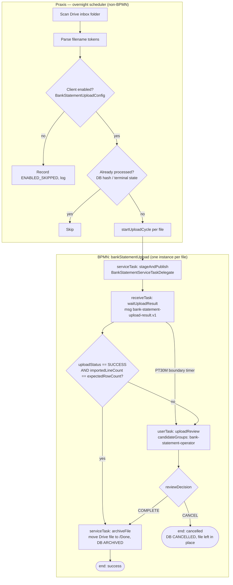

# Daily Bank Statement Upload to Xero — Design & Agent Handoff

| Date       | Author    | Summary                                                        |
| ---------- | --------- | -------------------------------------------------------------- |
| 2026-06-17 | Praxis BPM team | Initial design. Scope, BPMN flow, envelope contract, open questions. |
| 2026-06-17 | Praxis BPM team | Q6 resolved: CSV is pre-formatted to Xero's import layout (no agent column mapping). Q8 (MFA) routed to agent team. |
| 2026-06-17 | Praxis BPM team | Q1/Q3/Q5/Q9 resolved. Added **Bank Account + ERP Organisation registry** (§7.5): account number is the join key; Praxis resolves the exact Xero org (name + UUID) and passes it explicitly — agent no longer infers. Inline transport confirmed (HITL can download the file). Two daily runs (05:00 + 00:00 CR) + manual trigger. |
| 2026-06-18 | Praxis BPM team | `uploadFrequency` (DISABLED/DAILY/WEEKLY/MONTHLY) replaces the binary flag on `BankAccount` — drives service-level/overdue tracking. Q4 resolved (dedicated SQS queues; no cost change). Q11 confirmed. **Draft contracts checked in under `docs/contracts/`.** |

**Audience:** Praxis BPM modeling team (local development) **and** the NeoProc finance agent-worker team (Xero UI automation half). Sections 1–7 are shared context; **§8 is the agent team's deliverable**; §9–11 are Praxis-side build items; §12 lists coordination decisions that need both teams to ratify before code is written.

---

## 1. Problem & Decision Summary

A Google Drive folder receives **CSV bank statements** for many different clients and bank accounts. We want a **daily, overnight** process that:

1. Pulls all statement files from Drive.
2. Determines which client/account each file belongs to (from the **filename**).
3. Checks whether that client is **enabled** for daily bank-statement upload.
4. Hands the file to the **finance agent**, which logs into Xero (one user with access to all orgs), **switches to the correct Xero organisation**, navigates to the bank-statement import screen, uploads the CSV, and **verifies the import**.
5. On success, the file is **archived in Drive** so it is not re-uploaded.
6. On any failure/mismatch, a **Human-in-the-Loop (HITL)** task is raised; the human can **Complete** (resolve & archive) or **Cancel** (terminate, leave file) the cycle.

### Locked decisions (from scoping)

| # | Decision | Choice |
| - | -------- | ------ |
| D1 | File format | **CSV** (Xero-ready) |
| D2 | Upload mechanism | **UI automation by the finance agent** (Xero API cannot import statement files) |
| D3 | Xero org model | **One Xero user with access to all orgs**; agent switches org per file |
| D4 | File→client/account mapping | **Filename account number → Praxis Bank Account registry** (§7.5), which resolves the exact Xero org name + UUID. Praxis passes them **explicitly** in the envelope; the agent does **not** infer. |
| D5 | Who reads Drive | **Praxis** (service account); ships file bytes to the agent in the envelope |
| D6 | Idempotency | **Archive in Drive after success** (Praxis performs the move; agent never touches Drive) + DB hash dedup |
| D7 | Verification depth | **Statement appears in Xero + imported line count == CSV data-row count** |
| D8 | Schedule | **05:00 + 00:00 local (America/Costa_Rica)** daily + **manual trigger from Praxis** |
| D9 | Enablement / cadence | **`uploadFrequency` (DISABLED / DAILY / WEEKLY / MONTHLY) on the Bank Account entity** (§7.5). Gate = `!= DISABLED`; cadence drives service-level / overdue tracking. |
| D10 | Failure handling | **HITL task, file left in place**; HITL outcome is **Complete** or **Cancel** (exclusive gateway in BPMN) |

### Filename convention (D4)

```
ClientName_BankAccount_Currency_StartEndDates.csv

Example:
NEOPROCSOCIEDADANONIMA_920336542_USD_2026060120260617.csv
└── client name ──────┘ └ acct ─┘ └─┘ └── 20260601 | 20260617 ──┘
                                  currency  periodStart  periodEnd
```

Parsing rule: split on `_` into exactly 4 tokens; the 4th token is 16 digits = `periodStart(YYYYMMDD)` + `periodEnd(YYYYMMDD)`. **Constraint:** client names must be uppercased with spaces removed and **must not contain `_`** (it is the delimiter). Files that do not parse to exactly this shape are recorded as `DISCOVERED_INVALID`, logged, and surfaced on the dashboard (not auto-uploaded).

**The `BankAccount` token (account number) is the primary resolution key**, not the client name. Praxis looks up `BankAccount` by `(firmId, accountNumber, currency)` (§7.5) to obtain the target Xero organisation (name + UUID), the bank, the IBAN, the linked client, and the `dailyUploadEnabled` flag. The `ClientName` token is used only as a **sanity check** against the resolved account's client/org — a mismatch is treated as `DISCOVERED_INVALID` → HITL rather than uploaded to a guessed org.

---

## 2. Why an Agent (answering "do we need one?")

Xero's public API supports **bank feeds** and reading `BankTransactions`, but it has **no endpoint to upload a manual statement file**. The "Import a Statement" workflow — choosing the bank account, mapping CSV columns (date/amount/payee/reference), and clearing Xero's duplicate-statement warning — is **UI-only**. Therefore:

- **Praxis cannot do this through the existing `XeroConnector` (API/OAuth).** That connector stays for read/sync use cases.
- **The agent-worker (Java + Playwright on ECS Fargate)** is the correct and only viable tool for the upload itself.

This mirrors the payroll architecture: Praxis owns orchestration, credentials, encryption, and HITL; the agent owns portal UI automation.

---

## 3. Division of Responsibility

| Concern | Praxis | Agent-worker |
| ------- | ------ | ------------ |
| Daily scan & Drive listing | ✅ (Google Drive service account) | — |
| Filename parse + enablement check | ✅ | — |
| Idempotency / dedup (DB + Drive archive) | ✅ | — |
| Build & encrypt envelope, publish to SQS | ✅ | — |
| Xero login (shared user) + **org switching** | — | ✅ |
| Navigate import screen, **column mapping**, upload CSV | — | ✅ |
| Handle Xero duplicate-statement warning | — | ✅ |
| Read back imported line count, return result | — | ✅ |
| Verify count match + route SUCCESS/HITL | ✅ | — |
| Move file to `/Done` on success | ✅ | — |
| HITL task (Complete/Cancel) | ✅ | — |
| Xero credentials at rest | ✅ (AWS Secrets Manager) | fetched at runtime only |

**Credential boundary:** the agent never holds Drive credentials (Praxis pulls and ships the bytes) and never persists Xero credentials (fetched from Secrets Manager at runtime, same posture as payroll portals).

---

## 4. End-to-End Flow



### Agent round-trip (inside `stageAndPublish` → `waitUploadResult`)

1. Praxis downloads the CSV from Drive (service account), computes `sha256` + `expectedRowCount` (data rows excluding header).
2. Praxis builds a `bank-statement-upload-request.v1` envelope — routing metadata in the cleartext `task` block, the **file bytes (base64) in the encrypted body** — and publishes to the SQS task queue.
3. Agent consumes, fetches Xero credentials, logs in, **switches to the Xero org Praxis specified by `xeroOrgUuid` (name `xeroOrgName` as fallback)**, selects the bank account matching `bankAccountNumber` (+ `iban`/`currency` to disambiguate), uploads the pre-formatted CSV, clears any duplicate warning, and reads back the imported line count. No column mapping (Q6).
4. Agent publishes `bank-statement-upload-result.v1` to the results queue with `status` + `importedLineCount`.
5. Praxis correlates by `businessKey`, signals the receive task, and the gateway routes to archive or HITL.

---

## 5. Process Granularity: one instance per file

We use **one BPMN process instance per (client, account, period) file**, not one batch instance with a multi-instance subprocess. Rationale:

- A stuck file never blocks the others.
- Each file gets its own `businessKey`, HITL task, and Complete/Cancel decision (matches D10).
- The "daily" trigger is a lightweight **scheduler** (like `TaskDeadlineSchedulerService`) that enumerates files and starts N cycles — not a long-lived BPMN instance holding a multi-instance loop.

`businessKey` format: `{clientName}::{bankAccount}::{currency}::{periodStart}-{periodEnd}` (e.g. `NEOPROCSOCIEDADANONIMA::920336542::USD::20260601-20260617`). Duplicate business keys are refused at `startUploadCycle`, giving in-flight dedup on top of Drive archival.

---

## 6. File Transport: inline (DECIDED)

**Decision (Q3): inline the file as base64 inside the encrypted envelope body** — confirmed. Bank-statement CSVs are tiny (a month of lines is a few KB–tens of KB), so inlining is the same shape payroll bodies use and avoids a **net-new S3 client + bucket + IAM grant to the agent**. A side benefit the user called out: because Praxis holds the bytes, **the HITL task can surface the file for download/manual upload** without round-tripping to Drive.

- SQS hard limit is **256 KB per message**; base64 inflates ~33%, so raw files up to ~**190 KB** fit inline. Bank CSVs are comfortably under this.
- **HITL file access:** on failure the original file also remains in the Drive inbox (D6), and Praxis retains `driveFileId` on the `BankStatementUpload` row, so the `uploadReview` task exposes a download link (re-fetch from Drive by id) for the human to inspect or upload manually.
- **Guard rail (kept, not day-one work):** if a file ever exceeds `praxis.bankstatement.inline-max-bytes` (default 180 KB), publish fails loudly to a HITL task rather than silently truncating; an `s3` reference field is reserved in the contract for a future large-file path but is **not** built now.

The contract body carries an `inline` reference now; the `s3` field stays `null`/reserved. See §8.

---

## 7. Verification & Reconciliation Contract (D7)

"Uploaded correctly" is **not** a single boolean — it is a set of **independent checks**, each of which can pass or fail on its own, and each of which carries `expected` vs `observed` values so a human can see exactly what went wrong. The agent runs every applicable check, returns them as a structured `checks[]` array plus a `reconciliation` block, and Praxis **independently re-asserts** the critical ones in the `uploadStatus` gateway (defense in depth — never trust a single self-reported boolean).

### 7.1 The checks

| Check (`checks[].name`) | Expected (Praxis) | Observed (agent, from Xero) | On fail |
| ----------------------- | ----------------- | --------------------------- | ------- |
| `ORG_SELECTED` | `xeroOrgUuid` | org the agent landed in | `ORG_NOT_FOUND` |
| `ACCOUNT_SELECTED` | `bankAccountNumber` (+`iban`) | account selected | `ACCOUNT_NOT_FOUND` |
| `FILE_ACCEPTED` | file uploads without rejection | Xero accept/reject | `UPLOAD_REJECTED` / `FILE_CORRUPT` |
| `NO_DUPLICATE` | no overlap warning | Xero duplicate prompt | `DUPLICATE_STATEMENT` |
| `ROW_COUNT` | `expectedRowCount` (CSV data rows ex-header) | `importedLineCount` (lines Xero imported) | `COUNT_MISMATCH` / `PARTIAL_IMPORT` |
| `NET_MOVEMENT` | `expectedNetMovement` = Σ(Amount) from the CSV | (closing − opening) balance delta Xero applied | `NET_MOVEMENT_MISMATCH` |
| `OPENING_BALANCE` | `expectedOpeningBalance` *(if known — see Q13)* | opening balance Xero shows for the statement | `OPENING_BALANCE_MISMATCH` |
| `CLOSING_BALANCE` | `expectedClosingBalance` *(if known — see Q13)* | closing balance Xero shows for the statement | `CLOSING_BALANCE_MISMATCH` |

- **Always available:** `ROW_COUNT` and `NET_MOVEMENT` — Praxis can compute both from the Xero-format CSV (count of data rows; sum of the `Amount` column) with no extra input. `NET_MOVEMENT` catches missing/duplicate transactions even when the count happens to match.
- **Available only if the CSV carries a Balance column / a sidecar supplies them (Q13):** `OPENING_BALANCE`, `CLOSING_BALANCE`. When the expected value is `null` the check is reported as `SKIPPED` (not failed) and Praxis does not gate on it.
- **Monetary values** are JSON **strings** with a decimal pattern (e.g. `"1279.50"`) to avoid float drift — same posture as payroll `BigDecimal`-as-string. Currency is on the `reconciliation` block.

### 7.2 Status derivation (precedence)

| `status` | Meaning | Trigger |
| -------- | ------- | ------- |
| `FAILED` | Nothing imported | any access/account/file check failed (`ORG_SELECTED`/`ACCOUNT_SELECTED`/`FILE_ACCEPTED` failed, or Xero unreachable) |
| `MISMATCH` | Imported but a reconciliation check failed | `NET_MOVEMENT`/`OPENING_BALANCE`/`CLOSING_BALANCE`/`DUPLICATE` failed |
| `PARTIAL` | Imported but incomplete | `ROW_COUNT` short (`importedLineCount < expectedRowCount`), some `rejectedRows[]` |
| `SUCCESS` | Imported, every applicable check passed | all checks `passed` or `SKIPPED` |

Praxis routes **anything other than `SUCCESS` to HITL** (D10). The status only picks the headline; the `checks[]`, `reconciliation`, `rejectedRows[]`, and `diagnostics` carry the detail (§8.2) and are persisted on the `BankStatementUpload` row and surfaced on the HITL task (§7.7).

⚠️ Both teams must use the **same counting + summation definitions** (exclude header, exclude blank trailing lines, parse `Amount` sign consistently, round to the account's currency scale). Pinned in §12-Q7.

---

## 7.5 Reference Data Model — Bank Accounts & ERP Organisations

To make file→org resolution deterministic (Q1), Praxis owns two new firm-scoped reference entities surfaced as **two admin tabs** ("Bank Accounts" and "ERP Organisations"). The filename's **account number is the join key**: the scan resolves a `BankAccount`, which points at the `ErpOrganization` the account lives in, and Praxis passes the org's **name + UUID** explicitly to the agent.

### `ErpOrganization` (tab: "ERP Organisations")

One row per external accounting org the firm operates in. For Xero this is the **organisation name + Xero tenant UUID**; the model is provider-agnostic (Zoho, etc. later).

| Field | Notes |
| ----- | ----- |
| `id`, `firmId` | firm-scoped (`AbstractFirmEntity`) + RLS |
| `provider` | enum `IntegrationProvider` (XERO, ZOHO_BOOKS, …) |
| `orgName` | display name as it appears in the ERP org switcher |
| `orgUuid` | Xero **tenant UUID** — the authoritative selector the agent uses to switch org |
| `externalConnectionId` | optional FK to `ExternalConnection` (the API/OAuth side), if one exists. The single shared Xero UI login is **not** modeled here — that's a Secrets Manager credential (Q8). |
| `enabled` | org-level on/off |
| Unique | `(firm_id, provider, org_uuid)` |

> **Why UUID and not just name:** Xero org display names are not guaranteed unique or stable; the **tenant UUID is the stable, unambiguous selector**. Praxis sends both; the agent prefers the UUID and uses the name only as a human-readable fallback/label.

### `BankAccount` (tab: "Bank Accounts")

One row per bank account that can receive statement uploads. **This entity also carries the daily-upload enablement flag (D9), replacing the earlier `BankStatementUploadConfig` idea.**

| Field | Notes |
| ----- | ----- |
| `id`, `firmId` | firm-scoped + RLS |
| `erpOrganizationId` | FK → `ErpOrganization` (which Xero org this account lives in) |
| `clientId` | optional FK → client/`Firm`-side client entity, for reporting + the filename sanity check |
| `bankName` | display |
| `accountNumber` | **the filename join key** |
| `currency` | ISO code; disambiguates when an account number repeats across currencies |
| `iban` | optional, unique natural key when present; secondary disambiguator for the agent |
| `uploadFrequency` | enum **`DISABLED` / `DAILY` / `WEEKLY` / `MONTHLY`** — the enablement gate (D9) *and* the service-level cadence. Gate = `!= DISABLED`. |
| `frequencyAnchor` | optional — day-of-week (1–7) for `WEEKLY`, day-of-month (1–31) for `MONTHLY`; used only for overdue computation, not to block uploads |
| `lastUploadedAt` | timestamp of last successful upload for this account; feeds overdue/SLA tracking |
| `driveFolderId` | optional per-account inbox override (else firm default) |
| `hasHeader` | CSV header present (default true) — feeds `expectedRowCount` |
| Unique | `(firm_id, account_number, currency)`; plus partial-unique on `iban` where not null |

**Frequency semantics:** file processing is **opportunistic** — any statement file that appears for a non-`DISABLED` account is uploaded whenever the scan finds it (statements arrive pre-cut for their period). `uploadFrequency` does **not** gate which days the scan runs; it sets the **expected cadence / service level** so the dashboard can flag an account as **overdue** (e.g. a `MONTHLY` account with `lastUploadedAt` > ~35 days ago, a `WEEKLY` account > ~10 days, a `DAILY` account > ~2 business days). This gives you the "right service level" signal without coupling cadence to the upload mechanics.

### Resolution at scan time

```
filename → accountNumber + currency
        → BankAccount(firmId, accountNumber, currency)
            ├─ uploadFrequency == DISABLED? ── yes ─→ ENABLED_SKIPPED
            ├─ erpOrganization ──────────────────→ orgName + orgUuid  (explicit in envelope)
            ├─ iban ─────────────────────────────→ agent account disambiguation
            └─ clientId ─────────────────────────→ sanity-check vs filename ClientName token
no BankAccount match ─→ DISCOVERED_INVALID → HITL (account not registered)
```

This removes the fragile string-normalization between filename and Xero org names entirely: the agent receives an authoritative `xeroOrgUuid`.

---

## 7.7 HITL Troubleshooting Context

When a cycle routes to `uploadReview`, the human must be able to diagnose and act **without leaving Praxis or asking an engineer**. The `BankStatementServiceTaskDelegate`/`BankStatementResultListener` therefore populate the `WorkflowTask` (and the `BankStatementUpload` row) with a complete troubleshooting bundle, assembled from the result envelope:

**On the HITL task (human-readable):**
- **What & where:** client, bank, account number/IBAN, currency, period, file name, target Xero org (name + UUID).
- **Headline:** `status` + primary `errorCategory` + `errorMessage` (one-line plain-language summary, localized en/es).
- **Checks table:** every `checks[]` entry rendered as *Check / Expected / Observed / Result* — so "Closing balance: expected 12,490.50, Xero shows 12,260.00 ❌" is visible at a glance.
- **Reconciliation summary:** row count expected vs imported; net movement expected vs observed; opening/closing balance expected vs observed (or "not checked" when skipped).
- **Rejected rows:** the `rejectedRows[]` list (row number, raw line, Xero's reason) when Xero skipped specific lines.
- **Evidence:** inline screenshot(s) (`screenshotRefs[]`), the Xero error text (`xeroMessage`), and a **download link to the original CSV** (re-fetched from Drive by `driveFileId`, §6) so the human can inspect or upload manually.
- **Trace:** `businessKey`, `envelopeId`, `workerRunId`, and a CloudWatch `logRef` for engineering escalation.

**HITL actions (the BPMN `reviewDecision`, §10):**
- **Complete** — the human resolved it (e.g. uploaded manually, or confirmed the mismatch is acceptable). Optional free-text `resolutionNote` is captured on the `BankStatementUpload` row and audited; file is archived.
- **Cancel** — abandon this file (suppressed from retry, Q5); `resolutionNote` records why.

**Retry signal:** the result's `retryable` flag distinguishes **transient** failures (`XERO_UNREACHABLE`, `SESSION_EXPIRED`, `TIMEOUT`) from **needs-human** ones (balance mismatch, account not found). Transient + `retryable=true` may be auto-retried a bounded number of times by the delegate *before* raising HITL (config `praxis.bankstatement.max-auto-retries`, default 1); permanent failures go straight to HITL. Every attempt is audited with its `attemptCount`.

---

## 8. Envelope Contract — AGENT TEAM DELIVERABLE

New wire types to add to `contract-api` (GitHub Packages `com.neoproc.financialagent:contract-api`, bump to next version). Reuse existing `EnvelopeMeta`, `Encryption`, and the audit block.

### 8.1 `bank-statement-upload-request.v1`

```json
{
  "envelope": {
    "envelopeId": "1f3c…-uuid",
    "businessKey": "NEOPROCSOCIEDADANONIMA::920336542::USD::20260601-20260617",
    "firmId": 1,
    "locale": "es",
    "createdAt": "2026-06-17T06:00:00Z",
    "issuer": "praxis-bpm/bank-statement-process",
    "issuerRunId": "<flowableProcessInstanceId>"
  },
  "task": {
    "type": "bank-statement-upload",
    "operation": "import",
    "targetSystem": "XERO",
    "xeroOrgUuid": "e1f2a3b4-…-xero-tenant-uuid",
    "xeroOrgName": "Neoproc Sociedad Anónima",
    "clientName": "NEOPROCSOCIEDADANONIMA",
    "bankName": "Banco Nacional",
    "bankAccountNumber": "920336542",
    "iban": "CR0515200010920336542",
    "currency": "USD",
    "periodStart": "2026-06-01",
    "periodEnd": "2026-06-17",
    "fileName": "NEOPROCSOCIEDADANONIMA_920336542_USD_2026060120260617.csv",
    "expectedRowCount": 142,
    "expectedNetMovement": "1279.50",
    "expectedOpeningBalance": "11211.00",
    "expectedClosingBalance": "12490.50"
  },
  "encryption": { "scheme": "kms-envelope-v1", "keyName": "bankstmt-firm-1", "keyVersion": 1, "ciphertextField": "request" },
  "request": "vault:v1:…base64ciphertext…",
  "audit": { "payloadSha256": "<sha256-hex-of-cleartext-body>" }
}
```

Cleartext body shape (what `request` decrypts to; in local dev `encryption` is `null` and `request` is this object directly):

```json
{
  "file": {
    "contentType": "text/csv",
    "encoding": "base64",
    "sha256": "<hex>",
    "inline": "<base64 csv bytes>",
    "s3": null
  }
}
```

`inline` XOR `s3` — exactly one is non-null (see §6). When `s3` is used: `{ "bucket": "...", "key": "...", "presignedUrl": "...", "expiresAt": "..." }`.

**Reconciliation inputs** (`expectedNetMovement`, `expectedOpeningBalance`, `expectedClosingBalance`) are decimal **strings**. `expectedNetMovement` = Σ of the CSV `Amount` column and is always present. The two balances are **nullable** — Praxis sends them only when the CSV carries a Balance column or a sidecar provides them (§12-Q13); when `null`, the agent reports the corresponding check as `SKIPPED` and Praxis does not gate on it.

### 8.2 `bank-statement-upload-result.v1`

```json
{
  "envelope": { "…": "echoes envelopeId + businessKey + firmId + issuerRunId" },
  "task": { "…": "echoes the request task block" },
  "encryption": null,
  "result": {
    "status": "MISMATCH",
    "errorCategory": "CLOSING_BALANCE_MISMATCH",
    "errorMessage": "Imported 142 lines but the closing balance is off by 230.50.",
    "retryable": false,
    "failedStage": "VERIFY",
    "xeroOrgMatched": "Neoproc Sociedad Anónima",
    "bankAccountMatched": "920336542 (USD)",
    "reconciliation": {
      "currency": "USD",
      "expectedRowCount": 142,
      "importedLineCount": 142,
      "expectedNetMovement": "1279.50",
      "observedNetMovement": "1049.00",
      "expectedOpeningBalance": "11211.00",
      "observedOpeningBalance": "11211.00",
      "expectedClosingBalance": "12490.50",
      "observedClosingBalance": "12260.00",
      "statementDateRange": { "from": "2026-06-01", "to": "2026-06-17" }
    },
    "checks": [
      { "name": "ORG_SELECTED",     "passed": true,  "expected": "e1f2a3b4-…", "observed": "e1f2a3b4-…", "detail": null },
      { "name": "ACCOUNT_SELECTED", "passed": true,  "expected": "920336542",  "observed": "920336542",  "detail": null },
      { "name": "FILE_ACCEPTED",    "passed": true,  "expected": "accepted",   "observed": "accepted",   "detail": null },
      { "name": "NO_DUPLICATE",     "passed": true,  "expected": "no overlap", "observed": "no overlap", "detail": null },
      { "name": "ROW_COUNT",        "passed": true,  "expected": "142",        "observed": "142",        "detail": null },
      { "name": "NET_MOVEMENT",     "passed": false, "expected": "1279.50",    "observed": "1049.00",    "detail": "off by 230.50" },
      { "name": "OPENING_BALANCE",  "passed": true,  "expected": "11211.00",   "observed": "11211.00",   "detail": null },
      { "name": "CLOSING_BALANCE",  "passed": false, "expected": "12490.50",   "observed": "12260.00",   "detail": "off by 230.50" }
    ],
    "rejectedRows": [
      { "rowNumber": 88, "rawLine": "2026-06-12,-230.50,Bank Fee,Wire fee,FEE-0612", "reason": "Xero flagged as possible duplicate of line 41" }
    ],
    "errors": [
      { "category": "CLOSING_BALANCE_MISMATCH", "message": "Closing balance off by 230.50", "severity": "ERROR" },
      { "category": "NET_MOVEMENT_MISMATCH",    "message": "Net movement off by 230.50",    "severity": "ERROR" }
    ],
    "diagnostics": {
      "workerRunId": "worker-run-44ab12",
      "attemptCount": 1,
      "durationMs": 18432,
      "xeroUrl": "https://go.xero.com/Bank/BankAccount.aspx?...",
      "xeroMessage": "Statement imported. 142 of 142 lines.",
      "screenshotRefs": ["bankstmt/firm-1/920336542/2026-06-17/post-import.png"],
      "logRef": "cloudwatch:/financeagent/xero/worker-run-44ab12"
    }
  },
  "audit": { "payloadSha256": "<hex>" }
}
```

On `SUCCESS`, `errorCategory`/`failedStage`/`rejectedRows`/`errors` are null/empty and every `checks[].passed` is true (or `SKIPPED`).

**Status vocabulary** — see §7.2 for derivation. `SUCCESS` → archive; everything else → HITL with the full bundle (§7.7).

| Status | Meaning |
| ------ | ------- |
| `SUCCESS` | Imported; every applicable check passed |
| `PARTIAL` | Imported but incomplete (`ROW_COUNT` short / `rejectedRows[]`) |
| `MISMATCH` | Imported but a reconciliation check failed (balances / net movement / duplicate) |
| `FAILED` | Nothing imported (access / account / file) |

**Error-category enum** (`errorCategory` + `errors[].category`), grouped:

| Group | Categories |
| ----- | ---------- |
| Access | `XERO_UNREACHABLE`, `LOGIN_FAILED`, `MFA_REQUIRED`, `SESSION_EXPIRED`, `ORG_NOT_FOUND`, `ACCOUNT_NOT_FOUND` |
| File / format | `EMPTY_FILE`, `FILE_CORRUPT`, `UNSUPPORTED_FORMAT`, `COLUMN_MAPPING_FAILED` |
| Upload | `UPLOAD_REJECTED`, `DUPLICATE_STATEMENT`, `PARTIAL_IMPORT` |
| Reconciliation | `COUNT_MISMATCH`, `NET_MOVEMENT_MISMATCH`, `OPENING_BALANCE_MISMATCH`, `CLOSING_BALANCE_MISMATCH` |
| Other | `TIMEOUT`, `UNKNOWN` |

`retryable=true` is expected only for the transient ones (`XERO_UNREACHABLE`, `SESSION_EXPIRED`, `TIMEOUT`); reconciliation failures are always `retryable=false` (a human must look). `failedStage` ∈ `AUTH | ORG_SELECT | ACCOUNT_SELECT | UPLOAD | VERIFY | null`. A single statement may surface several problems — `errorCategory` is the **primary/most-severe**, `errors[]` lists them all.

JSON schemas (`bank-statement-upload-request.v1.json`, `bank-statement-upload-result.v1.json`) go under contract-api `schemas/v1/`, `$ref`-mapped the same way payroll schemas are, so Praxis's `SchemaValidator` validates on publish and on consume.

**Draft schemas + examples are checked in under [`docs/contracts/`](contracts/README.md)** (request/result JSON Schema, four example envelopes, and an agent-side integration checklist). They are NOT yet wired into the build — they're the artifact to hand the agent team for review before either side writes code.

### 8.3 Agent behaviour spec (Xero UI)

1. Fetch the shared Xero UI credential from Secrets Manager (secret name in §12-Q8). Handle/await any MFA per §12-Q8.
2. **Switch to the org Praxis specified by `task.xeroOrgUuid`** (Xero tenant UUID — authoritative). Use `task.xeroOrgName` only as a human-readable fallback/confirmation. Fail with `ORG_NOT_FOUND` if the UUID isn't accessible to the shared login. *(No name normalization needed — Q1 resolved by the Bank Account registry, §7.5.)*
3. Open **Accounting → Bank accounts** → the account matching `bankAccountNumber` (disambiguate with `iban`/`currency` if needed). Fail with `ACCOUNT_NOT_FOUND`. **Record the account's pre-import balance** (for the net-movement check).
4. Use **Import a Statement**, upload the CSV. **The CSV is pre-formatted to Xero's statement-import layout (Date / Amount / Payee / Description / Reference, with a header row), so no column mapping is required** — the agent uploads and proceeds. If Xero unexpectedly prompts for mapping, treat it as `COLUMN_MAPPING_FAILED` (don't guess).
5. If Xero warns about a **duplicate/overlapping statement**, do **not** force-import; record `NO_DUPLICATE` as failed → `status=MISMATCH`, `errorCategory=DUPLICATE_STATEMENT`.
6. After import, read back and populate the **full result**: `importedLineCount`, the imported statement's **opening & closing balance** (and/or the account balance delta) for the `reconciliation` block, any **rejected/skipped rows** into `rejectedRows[]`, and one `checks[]` entry per applicable check (skipped balance checks → omit/`SKIPPED` when the expected value was null). Compute each `passed` against the `expected*` values Praxis supplied; Praxis re-asserts independently.
7. Populate `diagnostics` (workerRunId, attemptCount, durationMs, the Xero URL + any on-screen message, `logRef`) and capture **screenshots** (`screenshotRefs[]`) of the confirmation and of any error/warning dialog. Set `errorCategory` (primary), `errors[]` (all), `failedStage`, and `retryable`.

---

## 9. Praxis-Side Build Items

All new tables are firm-scoped (`AbstractFirmEntity`) with RLS policy `USING (firm_id = current_firm_id())`. Liquibase IDs start at the next free range **`00000000001340`**.

| # | Component | Notes |
| - | --------- | ----- |
| 1 | `FirmSettings.bankStatementUploadEnabled` (bool, default false) | Gate, mirrors `payrollAgentsEnabled`. Migration `00000000001340`. |
| 2a | `ErpOrganization` entity + repo/service/DTO/resource + React tab | §7.5. Fields: `provider`, `orgName`, `orgUuid`, `externalConnectionId?`, `enabled`. Unique `(firm_id, provider, org_uuid)`. Migration `00000000001350` + RLS. **"ERP Organisations" admin tab.** |
| 2b | `BankAccount` entity + repo/service/DTO/resource + React tab | §7.5. Fields: `erpOrganizationId`, `clientId?`, `bankName`, `accountNumber`, `currency`, `iban?`, **`uploadFrequency` (enum DISABLED/DAILY/WEEKLY/MONTHLY)**, `frequencyAnchor?`, `lastUploadedAt?`, `driveFolderId?`, `hasHeader`. Unique `(firm_id, account_number, currency)` + partial-unique `iban`. **Carries the D9 cadence/enablement** (replaces the earlier `BankStatementUploadConfig`). Migration `00000000001360` + RLS. **"Bank Accounts" admin tab** (pick bank, currency, account number, IBAN, owning ERP org, and frequency). |
| 3 | `BankStatementUpload` tracking entity + repo/service | Audit + idempotency + dashboard + HITL context. Fields: `driveFileId`, `fileName`, `fileHash`, `bankAccountId` (resolved FK), `clientNameToken`, `accountNumber`, `currency`, `periodStart/End`, `expectedRowCount`, `importedLineCount`, **reconciliation:** `expectedNetMovement`, `observedNetMovement`, `expectedOpeningBalance`, `observedOpeningBalance`, `expectedClosingBalance`, `observedClosingBalance` (all `numeric`), **diagnostics/HITL:** `status` (enum below), `errorCategory`, `errorMessage`, `failedStage`, `retryable`, `attemptCount`, `checksJson` (JSONB — full `checks[]`), `rejectedRowsJson` (JSONB), `diagnosticsJson` (JSONB — workerRunId/xeroUrl/screenshotRefs/logRef), `resolutionNote` (HITL), `workflowInstanceId`, `flowableProcessInstanceId`, `businessKey`, `envelopeId`, `archivedAt`. Migration `00000000001370` + RLS. |
| 4 | `GoogleDriveClient` (**net-new**) | Service-account auth (JSON in Secrets Manager), `listFiles(folderId)`, `download(fileId)`, `move(fileId, toFolderId)`. `@ConditionalOnProperty(praxis.gdrive.enabled)` so local dev without creds still boots. New dep: `com.google.apis:google-api-services-drive` + `google-auth-library-oauth2-http`. |
| 5 | `BankStatementEnvelopeBuilderService` | Builds `bank-statement-upload-request.v1` from a `BankStatementUpload` row + file bytes; computes `payloadSha256`; resolves Encryption (cleartext when `praxis.bankstatement.encryption.enabled=false`). Parallels `PayrollEnvelopeBuilderService`. |
| 6 | `BankStatementServiceTaskDelegate` (`@Component`) | Flowable `JavaDelegate`. Reads process vars (`firmId`, `uploadId`, file metadata), builds + (optionally) encrypts + **validates-on-publish** + publishes to SQS task queue, emits `bankstatement.upload.published` audit, `BpmnError` on failure. Parallels `PayrollServiceTaskDelegate`. |
| 7 | `BankStatementResultListener` (`@SqsListener`) | Validates-on-consume against schema, deserializes typed result, sets vars (`uploadStatus`, `importedLineCount`, `errorCategory`, `errorMessage`), signals `waitUploadResult` by `businessKey`. HITL task on schema rejection. Parallels `PayrollResultListener`. |
| 7b | `BankStatementVerifyDelegate` (`@Component`) | `verifyReconciliation` service task (§10). Independently re-asserts the agent's `checks[]`/`reconciliation` (row count, net movement, balances-when-present), may downgrade self-reported `SUCCESS`→`MISMATCH`, persists reconciliation columns + `checksJson`/`rejectedRowsJson`/`diagnosticsJson` onto the `BankStatementUpload` row, sets `uploadStatus`. |
| 8 | `BankStatementArchiveDelegate` (`@Component`) | Moves Drive file to `/Done`, sets DB `ARCHIVED`/`archivedAt`, emits `bankstatement.upload.archived` audit. |
| 9 | `BankStatementUploadCycleService` | `startUploadCycle(firmId, uploadId)`: gate on `bankStatementUploadEnabled`, lazily provision per-firm `WorkflowTemplate` (category `bank-statement-upload`), create `WorkflowInstance`, refuse duplicate businessKey, set process vars incl. `praxisInstanceId`, `runtimeService.startProcessInstanceByKey("bankStatementUpload", businessKey, vars)`, emit `bankstatement.cycle.started`. Parallels `PayrollCycleService`. |
| 10 | `BankStatementScanScheduler` (`@Scheduled`) | **Two daily crons — 05:00 and 00:00 `America/Costa_Rica`** (§12-Q9; files land ~04:30, the midnight run catches intraday arrivals). Iterates firms with `bankStatementUploadEnabled=true`; lists each firm's inbox folder; parses filenames; resolves `BankAccount` by `(accountNumber, currency)` and checks `uploadFrequency != DISABLED`; **dedups by `fileHash` against terminal-state `BankStatementUpload` rows** (so a `CANCELLED` file is not retried, Q5); records rows; calls `startUploadCycle`. A separate lightweight check flags **overdue** accounts (no successful upload within the cadence window) for the dashboard. Per-file try/catch so one bad file doesn't strand the batch (same posture as `TaskDeadlineSchedulerService`). The scan body is a reusable method so the manual-trigger endpoint (item 13) and the schedule share one code path. |
| 11 | `BankStatementProcessDeployer` (`@EventListener(ApplicationReadyEvent)`) | Deploys `bpmn/bank-statement-upload.bpmn20.xml` with duplicate filtering, gated by `praxis.bpm.bankstatement.deploy.enabled` (default true). |
| 12 | `bank-statement-upload.bpmn20.xml` under `src/main/resources/bpmn/` | See §10. Wire `flowable:taskListener event="create" delegateExpression="${flowableTaskListener}"` on the HITL user task so it surfaces in the Praxis task UI. |
| 13 | REST `BankStatementUploadResource` + registry resources | `POST /api/v1/firms/current/bank-statement-uploads:scan` (**manual trigger** — runs the same scan as item 10, D8), `POST …/bank-statement-uploads` (ad-hoc single file), `GET …` (status dashboard list). Registry CRUD under `/api/v1/firms/current/bank-accounts/**` and `/api/v1/firms/current/erp-organizations/**`. firmId from JWT via `SecurityUtils.getCurrentFirmId()`. |
| 14 | SQS config additions | `bankStatementTaskQueueName`, `bankStatementResultsQueueName`, `bankStatementDlqName` in `AgentWorkerSqsConfiguration` (or sibling). See §12-Q4 for naming. |
| 15 | i18n (en/es) | Config UI, dashboard, BPMN task names, status labels, HITL form. No hardcoded strings. |
| 16 | Tests | Filename parser (valid/invalid/edge), envelope builder + schema fixture tests (mirror `PayrollSchemaFixtureValidationTest`), delegate publish, result listener (success + schema-reject + HITL), scan-scheduler dedup, cycle-service gate, archive delegate. |

### `BankStatementUpload.status` lifecycle

```
DISCOVERED → ENABLED_SKIPPED            (client not enabled)
DISCOVERED → DISCOVERED_INVALID         (unparseable filename)
DISCOVERED → QUEUED → UPLOADING → VERIFYING → UPLOADED → ARCHIVED   (happy path)
                                             ↘ FAILED → ESCALATED   (HITL)
ESCALATED → RESOLVED_MANUAL → ARCHIVED  (HITL Complete)
ESCALATED → CANCELLED                   (HITL Cancel; file left in place, see §12-Q5)
```

---

## 10. BPMN Sketch (`bankStatementUpload`)

Key elements (matching payroll conventions):

- `serviceTask id="stageAndPublish"` → `flowable:delegateExpression="${bankStatementServiceTaskDelegate}"`, extension field `operation=UPLOAD`, `targetSystem=XERO`.
- `receiveTask id="waitUploadResult" messageRef="bankStatementResultMsg"` where `<message name="bank-statement-upload-result.v1"/>`.
- `boundaryEvent` on the receive task, `cancelActivity=true`, `<timeDuration>PT30M</timeDuration>` → routes to the HITL `uploadReview` task (sets `failureReason=uploadTimeout`).
- `serviceTask id="verifyReconciliation"` → `${bankStatementVerifyDelegate}` — **re-asserts** the agent's `checks[]`/`reconciliation` independently (row count, net movement, and balances when present), can **downgrade** a self-reported `SUCCESS` to `MISMATCH`, and writes the persisted reconciliation columns + `checksJson` onto the `BankStatementUpload` row. Sets `uploadStatus` for the gateway. (The `BankStatementResultListener` may also short-circuit to HITL on schema rejection before this point.)
- `exclusiveGateway id="uploadStatus"`:
  - `${uploadStatus == 'SUCCESS'}` → `archiveFile` (SUCCESS already means every applicable check passed, §7.2).
  - else → `uploadReview` (the task carries the full §7.7 troubleshooting bundle).
- `userTask id="uploadReview"` `flowable:candidateGroups="bank-statement-operator"`, `taskListener` create → `${flowableTaskListener}`, with a required enum `formProperty`:
  - `COMPLETE` — "Resolved / uploaded manually — archive file"
  - `CANCEL` — "Cancel — leave file in place"
- `exclusiveGateway id="reviewDecision"`:
  - `${reviewDecision == 'COMPLETE'}` → `archiveFile` → `endSuccess`.
  - `${reviewDecision == 'CANCEL'}` → `endCancelled` (DB `CANCELLED`).
- `serviceTask id="archiveFile"` → `${bankStatementArchiveDelegate}` → `endSuccess`.

Deploy from `src/main/resources/bpmn/` (NOT `processes/`, to avoid `SystemTemplateSeeder` auto-deploy), via `BankStatementProcessDeployer`.

---

## 11. Config & Feature Flags

| Property | Default | Purpose |
| -------- | ------- | ------- |
| `firm_settings.bank_statement_upload_enabled` | false | Per-firm opt-in gate (DB) |
| `praxis.bpm.bankstatement.deploy.enabled` | true | Deploy BPMN on boot |
| `praxis.bankstatement.encryption.enabled` | false | Encrypt envelope body via KMS (cleartext otherwise; contract-valid) |
| `praxis.bankstatement.inline-max-bytes` | 184320 (180 KB) | Inline ceiling; over this → HITL, not silent truncation (§6) |
| `praxis.bankstatement.max-auto-retries` | 1 | Bounded auto-retries for `retryable` transient failures before raising HITL (§7.7) |
| `praxis.bankstatement.balance-tolerance` | 0.00 | Allowed abs. difference for balance/net-movement checks (rounding headroom) |
| `praxis.gdrive.enabled` | false | Gates `GoogleDriveClient` bean (local dev boots without Drive creds) |
| `praxis.gdrive.inbox-folder-id` / `done-folder-id` | — | Default Drive folders (per-account override on `BankAccount`) |
| `praxis.sqs.queue-prefix` | dev | Existing; selects queue env |
| `praxis.bankstatement.scan.cron-morning` | `0 0 5 * * *` | Daily 05:00 run |
| `praxis.bankstatement.scan.cron-midnight` | `0 0 0 * * *` | Daily 00:00 run (intraday catch-up) |
| `praxis.bankstatement.scan.zone` | `America/Costa_Rica` | Timezone for both crons |

---

## 12. Open Decisions for Both Teams (ratify before coding)

- **Q1 — Org resolution:** ✅ **RESOLVED (2026-06-17).** Replaced filename-string inference with the **Bank Account + ERP Organisation registry** (§7.5). The filename's **account number** is the join key; Praxis resolves the exact Xero org and passes `xeroOrgUuid` + `xeroOrgName` explicitly in the envelope. The agent switches by UUID — no normalization.
- **Q2 — Bank account selection:** 🔄 **Being handled by the agent team (2026-06-17).** Does Xero reliably show the **account number** (`920336542`) / IBAN so the agent can match it on the import screen? `currency` + `iban` are provided to disambiguate. Agent team to confirm against a real Xero screen.
- **Q3 — File transport:** ✅ **RESOLVED (2026-06-17): inline base64** in the envelope body (§6). Praxis retains `driveFileId` so the **HITL task can surface the file for download/manual upload**. No S3 client built now; an `s3` field is reserved for a future large-file path.
- **Q4 — Results queue:** ✅ **RESOLVED (2026-06-17): dedicated queues.** Task `{prefix}-financeagent-tasks-bankstatement-xero`, results `{prefix}-financeagent-bankstatement-results` (+ new `BankStatementResultListener`), DLQ `{prefix}-financeagent-bankstatement-dlq`. **Cost is effectively unchanged** — SQS bills per request, not per queue, and message volume is identical to the shared-queue option (first 1M requests/month are free). *Remaining coordination: confirm the agent runs a `PORTAL_ID=xero` worker against these queue names.*
- **Q5 — CANCEL semantics (D10):** ✅ **RESOLVED (2026-06-17): suppressed.** On HITL **Cancel** the file stays in Drive but the scan dedups by `fileHash` against terminal-state rows (incl. `CANCELLED`), so it is **not** retried. To re-run, an operator re-drops the file (new content/hash) or re-triggers it explicitly from the dashboard.
- **Q6 — Xero column mapping:** ✅ **RESOLVED (2026-06-17).** The CSV is delivered **pre-formatted to Xero's statement-import layout** (Date / Amount / Payee / Description / Reference + header row), so the agent does **not** perform column mapping. An unexpected mapping prompt = `COLUMN_MAPPING_FAILED` → HITL (guards against silent format drift). *Praxis still computes `expectedRowCount` against this known layout — see Q7.*
- **Q7 — Row-count definition (D7):** With Q6 resolved, the layout is fixed (Date/Amount/Payee/Description/Reference + header), so `expectedRowCount` = data rows excluding the header. Still pin: ignore blank trailing lines, and decide handling when `importedLineCount < expectedRowCount` because Xero legitimately de-duplicates (→ `PARTIAL`/`MISMATCH` → HITL).
- **Q8 — Xero credentials & MFA:** 🔄 **Being handled by the agent team (2026-06-17).** Secret name/shape in Secrets Manager for the shared Xero UI login (e.g. `xero/ui-login`) and the MFA strategy (TOTP seed / trusted session) are owned by the agent side. Praxis just needs the final secret name to reference. Awaiting the agent team's resolution.
- **Q9 — Schedule (D8):** ✅ **RESOLVED (2026-06-17).** Files arrive ~04:30. **Two daily runs, `America/Costa_Rica`: 05:00** (primary) and **00:00** (intraday catch-up), plus a **manual trigger** from Praxis (`POST …/bank-statement-uploads:scan`). Fixed crons (§11), not per-firm.
- **Q10 — Drive layout:** One inbox folder per firm with a sibling `/Done`? Or per-client subfolders? Where do `DISCOVERED_INVALID` / `CANCELLED` files go? *Proposed: per-firm `inbox` + `Done`; invalid/cancelled stay in inbox but are DB-suppressed.*
- **Q11 — Xero bank account prerequisite:** ✅ **CONFIRMED (2026-06-17).** Every target bank account already exists in Xero and is configured for manual statement import (not a live feed).
- **Q12 — Volume:** 🔄 **Being handled by the agent team (2026-06-17).** Expected files/accounts per night, to size SQS concurrency, Xero login rate, and lockout risk for repeated automated logins.
- **Q13 — Source of opening/closing balances (NEW, 2026-06-18):** The Xero-format CSV (Date/Amount/Payee/Description/Reference) **does not carry balances**, so absolute `OPENING_BALANCE`/`CLOSING_BALANCE` checks need a source. Options: (a) the CSV includes an optional **Balance column** (Xero import supports one) → Praxis derives opening/closing from it; (b) a **sidecar** file/field accompanies each statement; (c) skip absolute balances and rely on **`ROW_COUNT` + `NET_MOVEMENT`** only (always computable). *Proposed: support (a) when present, else degrade to (c) with the balance checks reported `SKIPPED`. Confirm whether your pre-formatted CSVs can include a Balance column.*
- **Q14 — Net-movement reference point (NEW, 2026-06-18):** `NET_MOVEMENT` compares Σ(CSV Amount) to the **account balance delta** Xero applied. Confirm the agent can read the account balance **before and after** import (or read the imported statement's own opening/closing) reliably enough to compute this. If not, `NET_MOVEMENT` degrades to `SKIPPED` and `ROW_COUNT` is the only always-on check.

---

## 13. Reuse Map (existing plumbing this leans on)

| Need | Reuse |
| ---- | ----- |
| Flowable delegate + SQS publish | `PayrollServiceTaskDelegate` pattern |
| SQS result listener + schema validate + signal | `PayrollResultListener` pattern |
| Cycle bootstrap (template/instance/businessKey/audit) | `PayrollCycleService` pattern |
| Envelope build + sha256 + Encryption | `PayrollEnvelopeBuilderService` pattern |
| BPMN deploy on boot | `PayrollProcessDeployer` pattern |
| Scheduled cross-firm scan | `TaskDeadlineSchedulerService` pattern |
| Firm-scoped entity + RLS + REST stack | `FirmPortalIdentifier` pattern |
| Feature flag on FirmSettings | `payrollAgentsEnabled` pattern |
| KMS envelope encryption | `KmsEnvelopeClient` (`vault:v1:` wire prefix, `kms-envelope-v1` scheme) |
| Contract records + `SchemaValidator` | `contract-api` JAR |
| HITL task surfacing | `flowableTaskListener` + `WorkflowInstance`/`WorkflowTask` |

**Net-new:** Google Drive client (and S3 client only if Q3 chooses S3).
